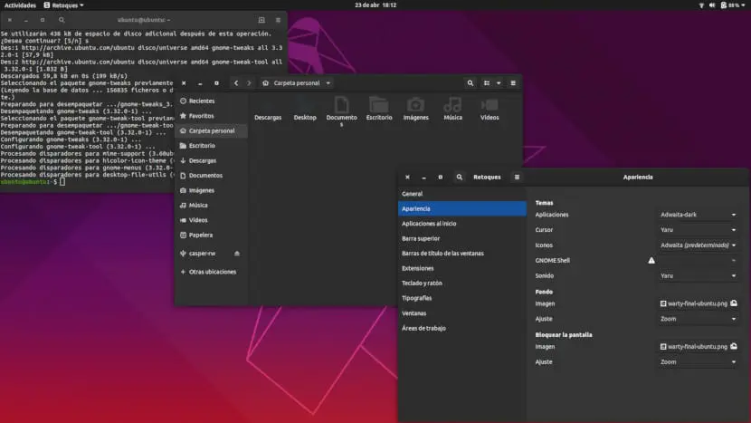

# Adwaita for C++ (adw-cpp)



Modern C++23 language bindings for [Libadwaita](https://gnome.pages.gitlab.gnome.org/libadwaita/) and [GTK 4](https://docs.gtk.org/gtk4/), auto-generated from GObject Introspection metadata.

Build fully adaptive GNOME applications in idiomatic C++23 — with type-safe signals, property proxies, RAII memory management, and C++20 module support.

---

## Features

- **Complete coverage** — ~1,900 binding files across 16 namespaces: Adw, Gtk, Gio, GLib, GObject, GDK, Pango, Cairo, Graphene, GSK, and more
- **Type-safe API** — strong C++ types wrapping the GObject type system; no raw `gpointer` leakage
- **Signal & property proxies** — connect to GObject signals and access properties via generated proxy objects
- **Transfer semantics** — `gi::transfer_full` / `gi::transfer_none` track ownership and prevent leaks
- **C++20 modules** — optional `*.cppm` module units for each namespace
- **Modern CMake** — exported targets, pkg-config file, and `find_package` support

---

## Dependencies

| Library | pkg-config name |
|---------|----------------|
| Libadwaita 1 | `libadwaita-1` |
| GTK 4 | `gtk4`, `gtk4-unix-print` |
| Graphene | `graphene-1.0` |

Install on Fedora / GNOME-based distros:
```bash
sudo dnf install libadwaita-devel gtk4-devel graphene-devel
```

Install on Debian / Ubuntu:
```bash
sudo apt install libadwaita-1-dev libgtk-4-dev libgraphene-1.0-dev
```

---

## Building

```bash
cmake -B build
cmake --build build
```

### Install system-wide

```bash
cmake --install build
```

This installs:
- `libgi-repository-adw-standalone.so` → `${libdir}`
- Headers → `${includedir}/gi-repository-adw/`
- CMake package → `${libdir}/cmake/GiRepositoryAdw/`
- pkg-config file → `${libdir}/pkgconfig/gi-repository-adw.pc`

---

## Using in your project

### CMake (recommended)

```cmake
find_package(AdwCpp REQUIRED)

target_link_libraries(my-app PRIVATE AdwCpp::adw-cpp)
```

### pkg-config

```bash
pkg-config --cflags --libs adw-cpp
```

---

## Quick start

```cpp
#include <adw/adw.hpp>

namespace adw = gi::repository::Adw;
namespace gtk = gi::repository::Gtk;

class MyApp : public adw::ApplicationBase {
public:
    void on_activate() {
        auto window = adw::ApplicationWindow::new_();
        window.set_application(*this);
        window.set_title("Hello, Adwaita!");
        window.set_default_size(800, 600);

        auto toolbar_view = adw::ToolbarView::new_();
        auto header = adw::HeaderBar::new_();
        toolbar_view.add_top_bar(header);

        auto label = gtk::Label::new_("Hello, World!");
        toolbar_view.set_content(label);

        window.set_content(toolbar_view);
        window.present();
    }
};

int main(int argc, char *argv[]) {
    auto app = adw::Application::new_("org.example.Hello", {});
    app.signal_activate().connect([&]{ app.on_activate(); });
    return app.run(argc, argv);
}
```

---

## Namespace structure

| C++ namespace | Module | Covers |
|---|---|---|
| `gi::repository::Adw` | `adw.cppm` | Libadwaita widgets & utilities |
| `gi::repository::Gtk` | `gtk.cppm` | GTK 4 widget toolkit |
| `gi::repository::Gio` | `gio.cppm` | Async I/O, actions, app model |
| `gi::repository::GLib` | `glib.cppm` | Core utilities & types |
| `gi::repository::GObject` | `gobject.cppm` | GObject type system |
| `gi::repository::Gdk` | `gdk.cppm` | Display, surface, input |
| `gi::repository::Pango` | `pango.cppm` | Text layout & rendering |
| `gi::repository::Cairo` | `cairo.cppm` | 2D vector graphics |
| `gi::repository::Graphene` | `graphene.cppm` | 2D/3D math primitives |

---

## API patterns

### Constructors

```cpp
auto row = adw::ActionRow::new_();
```

### Properties

```cpp
row.set_title("Username");
row.set_subtitle("Your display name");
auto title = row.get_title();
```

### Signals

```cpp
button.signal_clicked().connect([]{ /* handler */ });
row.signal_activated().connect([&]{ handle_row(); });
```

### Optional / nullable parameters

Every method that accepts a nullable GObject provides a no-arg overload to pass `nullptr`:

```cpp
row.set_activatable_widget(some_widget);  // set
row.set_activatable_widget();             // clear (pass nullptr)
```

---

## License

See [LICENSE](LICENSE) for details.
